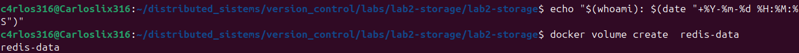
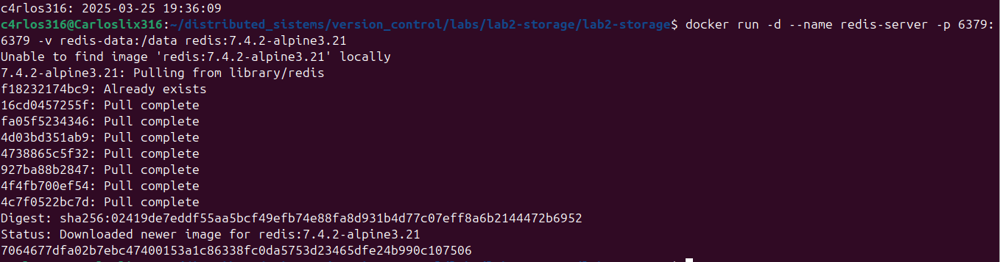
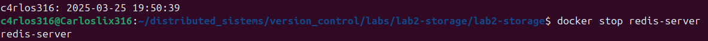
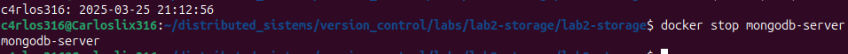

# Laboratorio 1: Imágenes Docker

## Procedimiento

### 1. Crear repositorio

Clonamos nuestro repositorio



### 2. Crear contenido web

Para crear nuestro archivo, usamos el comando

```bash
git touch index.html
```


La estructura es la siguiente:

**index.html**

```html
<!DOCTYPE html>
<html>
<head>
<title>Bienvenido a Apache</title>
</head>
<body>
<h1>¡Hola desde el servidor HTTP Apache!</h1>
<p>Esto se sirve desde un Docker Contenedor.</p>
</body>
</html>
```


### 3. Crear Dockerfile

Creamos el Dockerfile con el comando:

```bash
git touch Dockerfile
```



Para la versión de Apache, obtuve los datos del siguiente enlace:

Referencia: https://hub.docker.com/_/httpd

Donde la versión actual es `httpd:2.4`

**Dockerfile**

```Dockerfile
FROM httpd:2.4
COPY index.html /usr/local/apache2/htdocs/
EXPOSE 80

```


#### Crear una imagen de Apache personalizada

Crea la imagen usando los siguientes parámetros:
- Nombre de la imagen: `custom-apache`. - Etiqueta: `1.0.0`

```bash
docker build -t custom-apache:1.0.0 .
```


### 4. Ejecutar contenedor personalizado

Ejecute un contenedor usando la imagen personalizada.
- Asigne el nombre del contenedor a `apache-container` .
- Asigne el puerto expuesto del contenedor a `8080` en el equipo host.

```bash
docker run -d --name apache-container -p 8080:80 custom-apache:1.0.0
```



#### Ver registros del contenedor

Ver contenedor

```bash
docker ps
```


Seguimiento de los registros en tiempo real:

```bash
docker logs -f apache-container
```


Acceso desde el navegador: http://localhost:8080


### 5. Imagen de Apache precompilada

Obtenga la imagen oficial del servidor HTTP Apache de Docker Hub.

Para esta parte, al consultar la página oficial de la imagen, la versión más reciente es la 2.4.63. Sin embargo, al investigar, vi que si incluyo la versión 2.4 en el comando, se descargará la versión más reciente.

```bash
docker pull httpd:2.4
```


#### Ejecutar el contenedor oficial de la imagen de Apache

- Establezca el nombre del contenedor como `apache-default`.
- Asignar el puerto expuesto del contenedor a `9090` en el equipo host.

```bash
docker run -d --name apache-default -p 9090:80 httpd:2.4
```


Acceso en el navegador: http://localhost:9090


#### Detenga y elimine el contenedor una vez verificado.

```bash
docker stop apache-default
docker rm apache-default
```


### 6. Limpieza

- Detenga y elimine el contenedor Apache personalizado.

```bash
docker stop apache-container
docker rm apache-container

```


- Elimine la imagen personalizada de su equipo local.

```bash
docker rmi custom-apache:1.0.0
```



### 7. Subir archivos

```bash
git add .
git commit -m "feat(LAB1-DOCKER): implementar flujo de trabajo personalizado de imagen Docker de Apache"

```


## Referencias

- [Imagen oficial de Docker de Apache - Docker Hub](https://hub.docker.com/_/httpd)
- [Documentación de Docker](https://docs.docker.com/)
