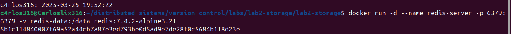
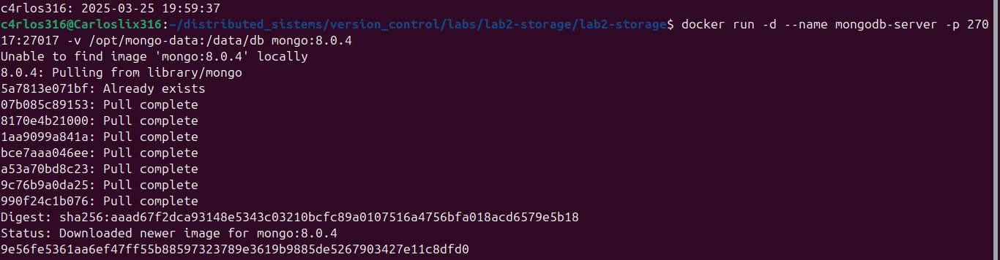
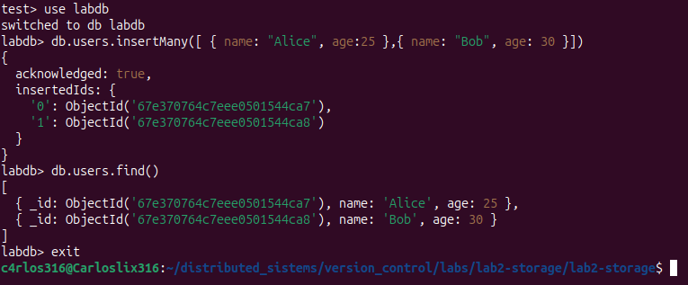
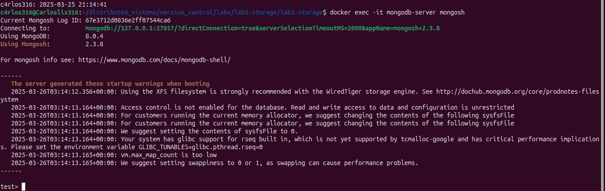
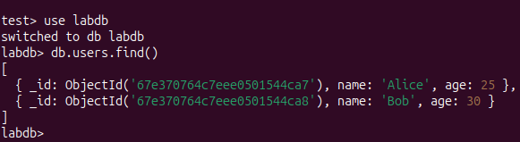

# Lab 2: Storage

## **Procedure**

### **1. Set Up a Volume**
Create a Docker volume named `redis-data`:

   ```bash
   docker volume create redis-data
   ```


   
Verify that the volume was created:
   ```bash
   docker volume ls
   ```

The list of containers on my computer is displayed.


Check the info about the volume.

   ```bash
   docker volume inspect redis-data
   ```


### **2. Run the Container**
Launch a **Redis** container with the following parameters:
    - Image Version: `7.4.2-alpine3.21`
    - Container name: `redis-server` .
    - Use the `redis-data` volume created in the previous step to persist Redis data `( /data )`.
    - Map the container's default Redis port `( 6379 )` to your host machine.


The following command is used, which was very similar to the one seen in class with the difference that we only added the name of the volume and the directory for persistence after the -v flag.

    ```bash
   docker run -d --name redis-server -p 6379:6379 -v redis-data:/data  redis:7.4.2-alpine3.21
   ```


Verify that the container is running:
   ```bash
   docker ps
   ```


### **3. Perform Redis Operations**
Access the Redis container:

To access the container I used this command which, upon investigation, I saw that sh was added at the end since in class we used bash, but I understood that it changes according to the container we use.

   ```bash
   docker exec -it redis-server sh
   ```


Execute the following Redis commands:
   ```bash
   redis-cli
   SET user:1 "Alice"
   SET user:2 "Bob"
   KEYS *
   quit
   ```


### **4. Redis Data Persistence**
Stop the Redis container:

   ```bash
   docker stop redis-server
   ```


Remove the container:
   ```bash
   docker rm redis-server
   ```


Launch a new Redis container using the same volume.

   ```bash
   docker run -d --name redis-server -p 6379:6379 -v redis-data:/data  redis:7.4.2-alpine3.21
   ```



Access Redis and check if the data persists:


   ```bash
   docker exec -it redis-server sh
   redis-cli
   KEYS *
   ```

When we delete the container and relaunch it, we can see that the values are still saved due to the data persistence that is configured at startup.


---

### **5 MongoDB Data Directory**
Create a directory on your host machine for MongoDB data in `/opt/mongo-data`


   ```bash
   mkdir -p /opt/mongo-data
   ```


Set the appropriate permissions:
   ```bash
   chmod 777 /opt/mongo-data
   ```


### **6. Run the MongoDB Container**

Launch a MongoDB container with the following parameters
    - MongoDB version: `8.0.4`
    - Container name: `mongodb-server`
    - Use the directory created previously to bind to the data directory inside the container: `/data/db`
    - Map the container's default MongoDB port `( 27017)` to the host.

    ```bash
   docker run -d --name mongodb-server -p 27017:27017 -v /opt/mongo-data:/data/db  mongo:8.0.4
   ```




Verify that the container is running:
   ```bash
   docker ps
   ```


### **7. Perform MongoDB Operations**
Access the MongoDB container:

To access the container we use this command and searching on the internet we put the word `mongosh` at the end for mongoDB

   ```bash
   docker exec -it mongodb-server mongosh
   ```


Execute the following MongoDB commands:
   ```bash
   use labdb
   db.users.insertMany([
     { name: "Alice", age: 25 },
     { name: "Bob", age: 30 }
   ])
   db.users.find()
   exit
   ```




### **8. MongoDB Data Persistence**

Stop the Mongodb-server container:
   ```bash
   docker stop mongodb-server
   ```


Remove the container:
   ```bash
   docker rm mongodb-server
   ```


Launch a new MongoDB container using the same directory.
   ```bash
   docker run -d --name mongodb-server -p 27017:27017 -v /opt/mongo-data:/data/db  mongo:8.0.4
   ```


Access the MongoDB shell and verify that the data persists:

Just like the Redis case, here we can see that the data was saved regardless of whether the container was deleted and relaunched and the point of this lab was to review the data persistence from 2 different containers and also investigate the difference between them.

   ```bash
   docker exec -it mongodb-server mongosh
   use labdb
   db.users.find()
   ```







---

## **9. Answer the Questions**
1. **What is the key difference between Redis persistence and MongoDB persistence?**  

**Redis**
- Stores data in RAM, so it can access data from memory, which limits the amount of data that can be stored.
- Saves the dataset to disk by creating snapshots and logging files that only include attachments.
- Stores data as key-value pairs, where each data entry has a unique key.
- Supports various data types, such as sorted sets, hashes, arrays, lists, and strings.

**MongoDB**

- Stores data primarily in external memory storage.
- Stores data documents as serialized binary JSON (BSON). The maximum document size should be 16 MB.
- You can use in-memory caching for frequently accessed data and rely primarily on disk storage for persistence.

2. **What challenges did you face while working with Redis and MongoDB containers?**

- The first would be the structure for Redis, which was easier since the commands are similar to those we did in class. For MongoDB, you had to create a folder and then call that directory when creating the volume and granting it permissions.
- Also, the way to access the container and execute the commands was easier for me in Redis since it only involved writing three lines for the values, making it more visually understandable. For MongoDB, since it's a JSON, we have to assign the key, key, and value. So if you're not familiar with this structure, it can be difficult to understand the first time.

3. **Why should I choose a volume over a linked mount in a production environment, or vice versa?**
**Volume:**
- Location: Volumes are stored in the default Docker directory.
- Portability: Volumes are independent of specific host paths, making them easy to share between containers. - Best Use: Ideal for production environments or when persistent data storage is required.

**Bind Mount:**

- Location: Uses a specific path on the host machine
- Flexibility: Great for development, as you can edit files on the host and see changes in the container instantly.
- Best Use: Ideal for sharing files during development or debugging.

These are some of the main features of each, and it depends on the project being developed which one is more suitable than the other.

We would use volumes when:

- We need Docker to manage the data lifecycle.
- We are working in a production environment.

We would use bind mounts when:
- We need to work with live files.
- We want to have control over the data location.

---
## References

- [AWS: The Difference Between Redis and MongoDB](https://aws.amazon.com/es/compare/the-difference-between-redis-and-mongodb/)  
- [Stack Overflow: Difference Between Binding Mounts and Volumes](https://stackoverflow.com/questions/47150829/what-is-the-difference-between-binding-mounts-and-volumes-while-handling-persist)  
- [Medium: Docker Volumes and Bind Mounts with Examples](https://medium.com/@gacheruian99/docker-volumes-and-bind-mounts-with-examples-58b91c13ca3e)  
- [MongoDB vs Redis Comparison](https://www-mongodb-com.translate.goog/resources/compare/mongodb-vs-redis?_x_tr_sl=en&_x_tr_tl=es&_x_tr_hl=es&_x_tr_pto=wa)  
- [How to start a mongodb shell in docker container?](https://stackoverflow.com/questions/32944729/how-to-start-a-mongodb-shell-in-docker-container)  


