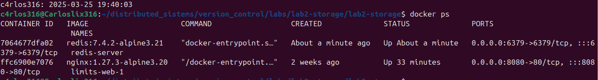
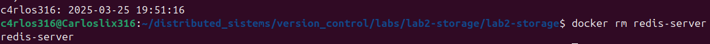
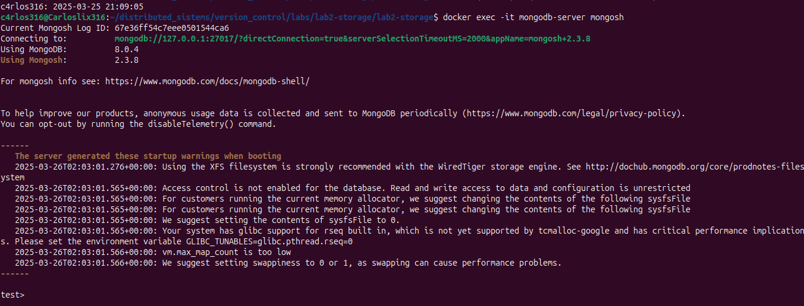
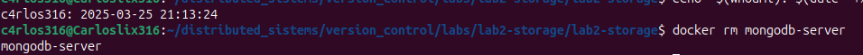

### 1. Repository Creation in Gitea
- I created a new repository in Gitea called **laboratorio 3 ** without an initial README.
- I cloned the repository to my local machine using:
  ```bash
  git@gitea.com:
  ```


### 2. Configure Environment Branches

Using the terminal:

#### Create the following branches to represent the environments and protect them:

**`development` : For active feature development**  

  ```bash
  git branch development 
  ```


 ```bash
  git push -u origin  development 
  ```


**`staging` : For testing and pre-production.**    
  
  ```bash
  git branch staging 
  ```


 ```bash
  git push -u origin stating 
  ```


**`production` : For the stable, live version.**  

  ```bash
  git branch production 
  ```



 ```bash
  git push -u origin  production 
  ```


**Protect the `staging` and `production` branches.**  

For the part about protecting branches, I did it from the web interface first:

I put the name of the branch `stating`:

- In the push part I left it as disable push


- Then I left the option `disable forced push`



- For the merge part I left `enable merge` and `block merge if pull request is out of date`


I repeated these same steps for the `production` branch.


### 3. Develop Features

Using the terminal:

**Switch to the `development` branch.**  

 ```bash
 git checkout development
  ```
**Create a `feature` branch for `implementing` a homepage .**  

 ```bash
 git checkout -b feature/homepage
  ```


Implement the following changes:

- Create a file `index.html` with a basic homepage structure. 

```bash
 touch index.html
 code index.html
  ```


- Structure file `index.html`


- Create a file `styles.css` for the homepage styling.



Structure `style.css`


- Add a script `main.js` to log "Hello, World!" to the browser console.


Structure `main.js`




**Make three separate commits:**  


- **Commit 1: `feat(GIT 0001 Add basic HTML structure for the homepage.`**  


- **Commit 2 `feat(GIT 0002 Add CSS styling for the homepage.`**  


- **Commit 3: `feat(GIT 0003 Add JavaScript functionality to log a message.`**


#### Push your changes to the feature branch.

```bash
 git push origin feature/homepage
  ```


### 4. Merge Changes into Development

Using the Web UI:

**Create the Pull Request using all the good practices reviewed in class.**  

- First we show the branches to merge and where we will get those changes we go from `feature/homepage` to the `development` branch


- We create our PR with the structure seen in class


**Merge the changes into `development`** 

- The merge that was made to our `development` branch is shown


- We download the changes to the local repository in the `development` branch

 ```bash
 git pull origin development
  ```


**Deleted branch from the remote and local repositories.**

*local:*
 ```bash
 git branch -d feature/homepage
  ```

*remote:*
 ```bash
 git push origin --delete feature/homepage 
  ```


### 5. Promote Changes to Staging

Using the Web UI

**Once testing in `development` is complete, create a Pull Request to merge the changes into `staging` also using the good practices.** 

- We make the PR from the `development` branch to the `stating` branch.


- We create our PR with the structure seen in class


- We download the changes to the local repository in the `stating` branch


### 6. Deploy Changesa to Production

Using the Web UI:

**Once testing in `staging` is complete, create a PR to merge the changes into `production`**


**Merge the changes into production.**

- We create our PR with the structure seen in class


Using the terminal:


- **Tag the release in the `production` branch.**


```bash
 git tag -a v1.0.0 -m "First release: Initial homepage release" 
  ```


- We show the tag created in the web UI


### 7. Handle a Hotfix

Using the terminal:

**Simulate a critical issue in production:**

To simulate an error in the production branch I first created a new branch:

- Create new branch `feature/brokenJs`

```bash
 git checkout -b feature/brokenJs 
  ```


- Then delete the semicolon that was in the `console.log` from the `main.js` file

- Identify a bug in `main.js`


We simulate that we sent our file remotely without realizing that it is misspelled using the commands:

```bash
git add
git commit
git push
  ```
 


- Accepted changes to merge `brokenJs` branches into `production`


`


**Create a `hotfix` branch from `production` .**


We download the changes and leave everything ready, realizing that there are errors in the js document

- Implement the fix.

- We create the `hotfix/js-error` branch

```bash
git checkout -b hotfix/js-error
  ```


- We fix the document and put the missing semicolon in it


- We push the `hotfix/js-error` branch


**Push the hotfix branch and create the PR to merge it into `production` .**

- We create the PR to send it to the `production` branch


**Merge the hotfix into `production` to deploy the fix, then promote it to `staging` and `development`.**

- We moved from `production` to `stating` with the new arrangement.


- We moved from `stating` to `development` with the final fixes to have all branches updated and without errors.


